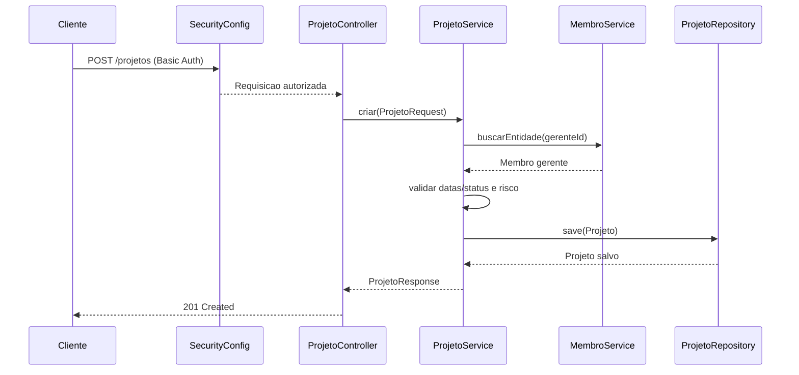
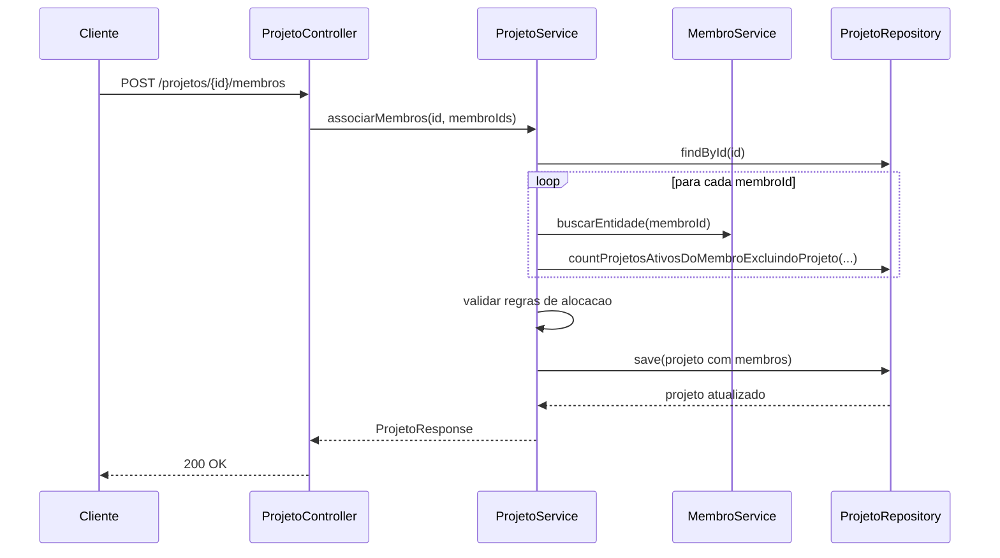
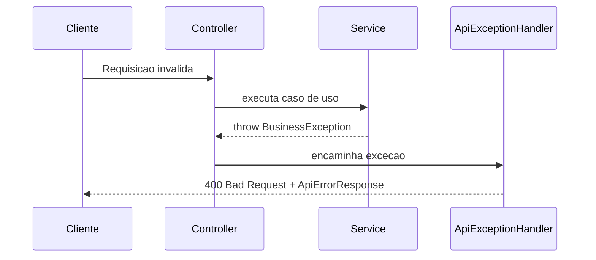

# Fluxo das APIs

## Criacao de projeto

```mermaid
sequenceDiagram
    participant C as Cliente
    participant SC as SecurityConfig
    participant PC as ProjetoController
    participant PS as ProjetoService
    participant MS as MembroService
    participant PR as ProjetoRepository

    C->>SC: POST /projetos (Basic Auth)
    SC-->>PC: Requisicao autorizada
    PC->>PS: criar(ProjetoRequest)
    PS->>MS: buscarEntidade(gerenteId)
    MS-->>PS: Membro gerente
    PS->>PS: validar datas/status e risco
    PS->>PR: save(Projeto)
    PR-->>PS: Projeto salvo
    PS-->>PC: ProjetoResponse
    PC-->>C: 201 Created
```

## Associacao de membros ao projeto

```mermaid
sequenceDiagram
    participant C as Cliente
    participant PC as ProjetoController
    participant PS as ProjetoService
    participant MS as MembroService
    participant PR as ProjetoRepository

    C->>PC: POST /projetos/{id}/membros
    PC->>PS: associarMembros(id, membroIds)
    PS->>PR: findById(id)
    loop para cada membroId
      PS->>MS: buscarEntidade(membroId)
      PS->>PR: countProjetosAtivosDoMembroExcluindoProjeto(...)
    end
    PS->>PS: validar regras de alocacao
    PS->>PR: save(projeto com membros)
    PR-->>PS: projeto atualizado
    PS-->>PC: ProjetoResponse
    PC-->>C: 200 OK
```

## Tratamento de erro de negocio

```mermaid
sequenceDiagram
    participant C as Cliente
    participant API as Controller
    participant S as Service
    participant H as ApiExceptionHandler

    C->>API: Requisicao invalida
    API->>S: executa caso de uso
    S-->>API: throw BusinessException
    API->>H: encaminha excecao
    H-->>C: 400 Bad Request + ApiErrorResponse
```

