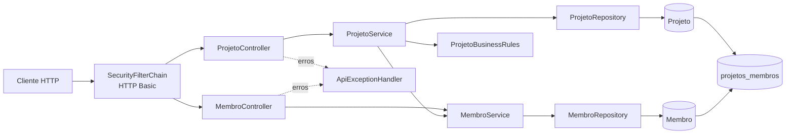
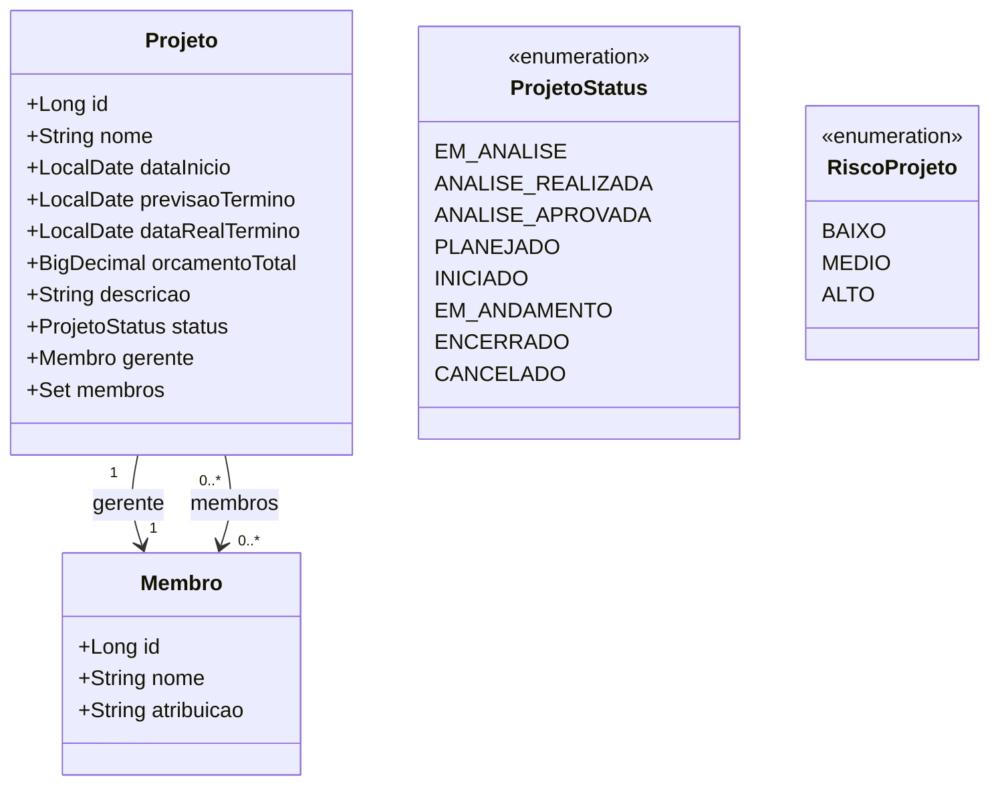

# Arquitetura

## Visao de camadas (MVC + Service + Repository)

```mermaid
flowchart LR
    Client[Cliente HTTP] --> Security[SecurityFilterChain\nHTTP Basic]
    Security --> ProjetoController[ProjetoController]
    Security --> MembroController[MembroController]

    ProjetoController --> ProjetoService[ProjetoService]
    MembroController --> MembroService[MembroService]

    ProjetoService --> ProjetoRules[ProjetoBusinessRules]
    ProjetoService --> ProjetoRepository[ProjetoRepository]
    ProjetoService --> MembroService

    MembroService --> MembroRepository[MembroRepository]

    ProjetoRepository --> Projeto[(Projeto)]
    MembroRepository --> Membro[(Membro)]
    Projeto --> Join[(projetos_membros)]
    Membro --> Join

    ProjetoController -. erros .-> ApiHandler[ApiExceptionHandler]
    MembroController -. erros .-> ApiHandler
```

## Modelo de dominio

```mermaid
classDiagram
    class Projeto {
      +Long id
      +String nome
      +LocalDate dataInicio
      +LocalDate previsaoTermino
      +LocalDate dataRealTermino
      +BigDecimal orcamentoTotal
      +String descricao
      +ProjetoStatus status
      +Membro gerente
      +Set<Membro> membros
    }

    class Membro {
      +Long id
      +String nome
      +String atribuicao
    }

    class ProjetoStatus {
      <<enumeration>>
      EM_ANALISE
      ANALISE_REALIZADA
      ANALISE_APROVADA
      PLANEJADO
      INICIADO
      EM_ANDAMENTO
      ENCERRADO
      CANCELADO
    }

    class RiscoProjeto {
      <<enumeration>>
      BAIXO
      MEDIO
      ALTO
    }

    Projeto "1" --> "1" Membro : gerente
    Projeto "0..*" --> "0..*" Membro : membros
```

