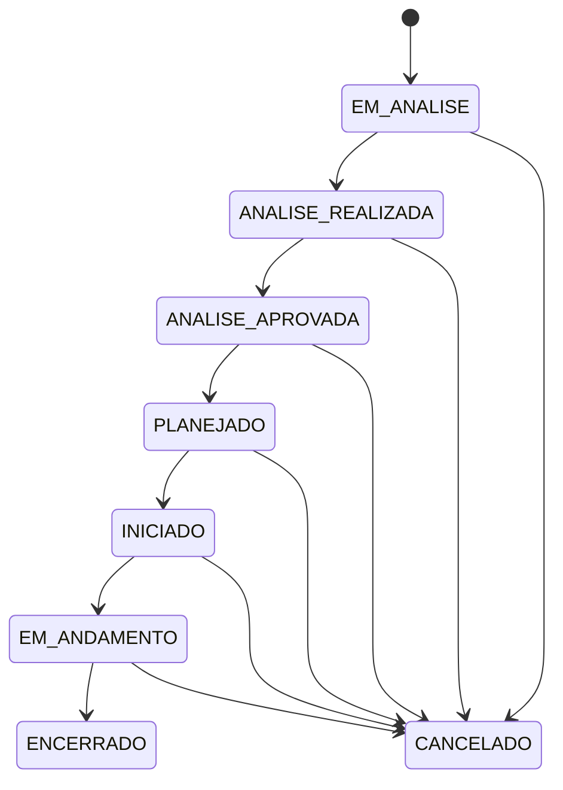
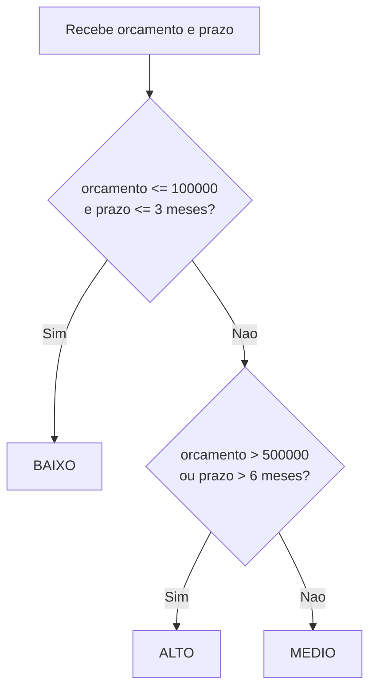
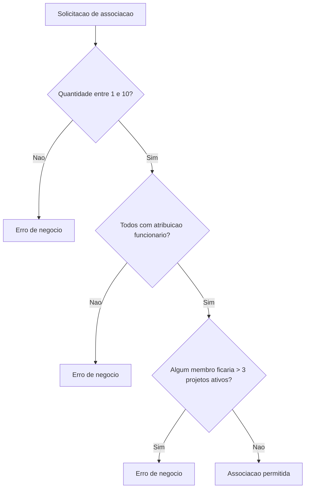
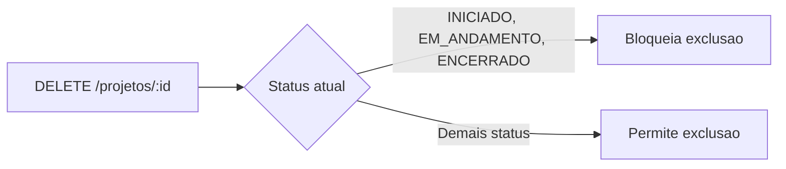

# Regras de Negocio e Estados

## Fluxo de status do projeto

```mermaid
stateDiagram-v2
    [*] --> EM_ANALISE
    EM_ANALISE --> ANALISE_REALIZADA
    ANALISE_REALIZADA --> ANALISE_APROVADA
    ANALISE_APROVADA --> PLANEJADO
    PLANEJADO --> INICIADO
    INICIADO --> EM_ANDAMENTO
    EM_ANDAMENTO --> ENCERRADO

    EM_ANALISE --> CANCELADO
    ANALISE_REALIZADA --> CANCELADO
    ANALISE_APROVADA --> CANCELADO
    PLANEJADO --> CANCELADO
    INICIADO --> CANCELADO
    EM_ANDAMENTO --> CANCELADO
```

## Regras de classificacao de risco

```mermaid
flowchart TD
    Start[Recebe orcamento e prazo] --> B1{orcamento <= 100000\ne prazo <= 3 meses?}
    B1 -- Sim --> R1[BAIXO]
    B1 -- Nao --> B2{orcamento > 500000\nou prazo > 6 meses?}
    B2 -- Sim --> R2[ALTO]
    B2 -- Nao --> R3[MEDIO]
```

## Regras de alocacao de membros

```mermaid
flowchart TD
    A[Solicitacao de associacao] --> Q1{Quantidade entre 1 e 10?}
    Q1 -- Nao --> E1[Erro de negocio]
    Q1 -- Sim --> Q2{Todos com atribuicao funcionario?}
    Q2 -- Nao --> E2[Erro de negocio]
    Q2 -- Sim --> Q3{Algum membro ficaria > 3 projetos ativos?}
    Q3 -- Sim --> E3[Erro de negocio]
    Q3 -- Nao --> OK[Associacao permitida]
```

## Regra de exclusao

```mermaid
flowchart LR
    D["DELETE /projetos/:id"] --> S{"Status atual"}
    S -- "INICIADO, EM_ANDAMENTO, ENCERRADO" --> X["Bloqueia exclusao"]
    S -- "Demais status" --> Y["Permite exclusao"]
```

